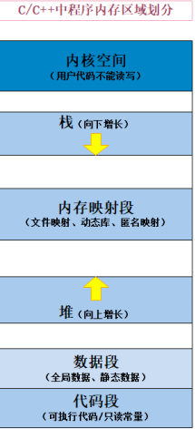

# Daily Notes
## ElasticSearch
## Linux
### 进程
- shell
```shell
# 进程树
pstree -p  |grep -C 10 1608
# 进程
ps -aux |grep PID
# 线程
ps -T -p 16089   
top -H -p 16089
```
* PCB  
进程作为运行中的程序，需要一个结构体记录执行信息，每个进程都只在CPU中运行很短时间，CPU拿到内存指针就知道进程相关信息
struct结构体包括标识符pid、状态status、上下文、优先级、CPU内存等相关信息
* 
* 进程调度
* 堆栈  
  
（1）静态（全局）存储区——static：内存在程序编译的时候就已经分配好，这块内存在程序的整个运行期间都存在。它主要存放静态数据、全局数据和常量。也是程序结束后，由操作系统释放。  
（2）栈区——stack：后进先出，在执行函数时，函数参数，局部变量（包括const局部变量），函数调用后返回的地址都在栈上创建，函数执行结束时这些存储单元自动被释放。栈内存分配运算内置于处理器的指令集中，效率很高，但是分配的内存容量有限。  
（3）堆区——heap：亦称动态内存分配。堆排序利于优先级，程序在运行的时候用malloc或new申请任意大小的内存，程序员自己负责在适当的时候用free或 delete释放内存。动态内存的生存期可以由我们决定，如果我们不释放内存，程序将在最后才释放掉动态内存。如果某动态内存不再使用，需要将其释放掉，否则，内存泄漏。
### tcp
* socket编程
 ```shell
# fd(一切皆文件）  
  ll /proc/PID/fd
```
  
* tcpdump
* pcap 
## Golang
### [GMP模型](https://www.kancloud.cn/aceld/golang/1958305#2GolangGMP_2)
线程(thread)内核线程，协程(coroutine)用户线程。一个“用户态线程”必须要绑定一个“内核态线程”，但是CPU并不知道有“用户态线程”的存在，它只知道它运行的是一个“内核态线程”(Linux的PCB进程控制块)。
频繁进程/线程切换/多线程/多进程，造成CPU、内存消耗。M:N提高CPU利用率。GM引入P(Processor)调度器，把可运行的goroutine分配到工作线程上(M)，利用队列缓存和P之间的G调度减少M锁，提高利用率。


## Python
## Docker
## Kubernetes
## Security
### burp
## HTTP
## BigData
### Flink
### ClickHouse
### Hadoop
### MongoDB
### Mysql

