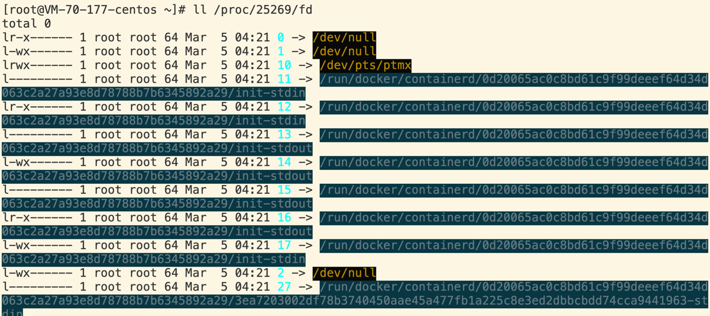
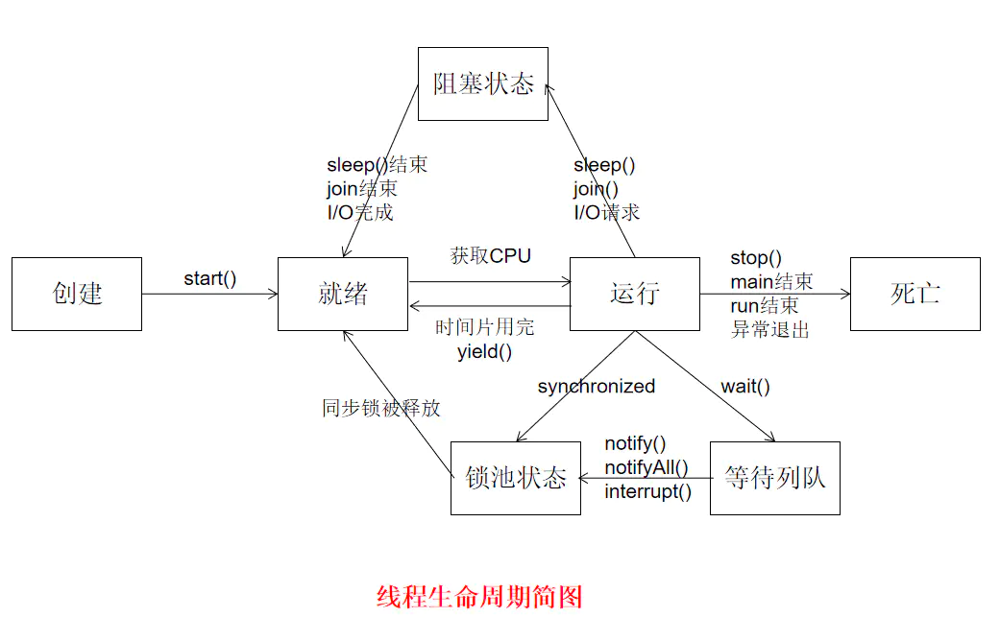

# Daily Notes
## ElasticSearch
## Linux
### 进程
- shell
```shell
# 进程树
pstree -p  |grep -C 10 1608
# 进程
ps -aux |grep PID
# 线程
ps -T -p 16089   
top -H -p 16089
```
* PCB  
进程作为运行中的程序，需要一个结构体记录执行信息，每个进程都只在CPU中运行很短时间，CPU拿到内存指针就知道进程相关信息
struct结构体包括标识符pid、状态status、上下文、优先级、CPU内存等相关信息

* 进程调度
* 堆栈  
  
（1）静态（全局）存储区——static：内存在程序编译的时候就已经分配好，这块内存在程序的整个运行期间都存在。它主要存放静态数据、全局数据和常量。也是程序结束后，由操作系统释放。  
（2）栈区——stack：后进先出，在执行函数时，函数参数，局部变量（包括const局部变量），函数调用后返回的地址都在栈上创建，函数执行结束时这些存储单元自动被释放。栈内存分配运算内置于处理器的指令集中，效率很高，但是分配的内存容量有限。  
（3）堆区——heap：亦称动态内存分配。堆排序利于优先级，程序在运行的时候用malloc或new申请任意大小的内存，程序员自己负责在适当的时候用free或 delete释放内存。动态内存的生存期可以由我们决定，如果我们不释放内存，程序将在最后才释放掉动态内存。如果某动态内存不再使用，需要将其释放掉，否则，内存泄漏。
### tcp
* socket编程
 ```shell
# fd(一切皆文件）  
  ll /proc/PID/fd
```
  
* tcpdump
```shell
 tcpdump -i eth1  -nn -s0 -vv  port 80 -w new_test.pacp
```
* pcap
* 线程生命周期

* [内存虚拟地址物理地址映射](https://blog.51cto.com/u_15169172/4711723)

## http
### header
* [jwt认证](https://learnku.com/go/t/52399)
* base认证
### payload
### burp

## Golang
### [GMP模型](https://www.kancloud.cn/aceld/golang/1958305#2GolangGMP_2)
线程(thread)内核线程，协程(goroutine)用户线程。一个“用户态线程”必须要绑定一个“内核态线程”，但是CPU并不知道有“用户态线程”的存在，它只知道它运行的是一个“内核态线程”(Linux的PCB进程控制块)。
频繁进程/线程切换/多线程/多进程，造成CPU、内存消耗。M:N提高CPU利用率。GM引入P(Processor)调度器，把可运行的goroutine分配到工作线程上(M)，利用队列缓存和P之间的G调度减少M锁，提高利用率。  

### CSP并发模型
### [调试优化](https://cloud.tencent.com/developer/article/1469185)
* pprof
* go test 
* go bench
```shell
go test -bench . -run none -benchmem -cpuprofile cpuprofile.out -memprofile memprofile.out
```

### map

## Python
###[爬虫](https://cuiqingcai.com/archives/)
### 迭代器&&生成器
## Docker
## Kubernetes
## Security
## BigData
### Flink
### ClickHouse
### Hadoop
### MongoDB
### Mysql
## ETC ZOOKEEPER CAP 乐观锁、悲观锁
乐观锁：不加锁，更新时需要判断冲突，悲观锁:读写加锁  
悲观锁比较适合强一致性的场景，但效率比较低，特别是读的并发低。乐观锁则适用于读多写少，并发冲突少的场景。
### CAP
* CA without P：如果不要求P（不允许分区），则C（强一致性）和A（可用性）是可以保证的。但放弃P的同时也就意味着放弃了系统的扩展性，也就是分布式节点受限，没办法部署子节点，这是违背分布式系统设计的初衷的。传统的关系型数据库RDBMS：Oracle、MySQL就是CA。
* CP without A：如果不要求A（可用），相当于每个请求都需要在服务器之间保持强一致，而P（分区）会导致同步时间无限延长(也就是等待数据同步完才能正常访问服务)，一旦发生网络故障或者消息丢失等情况，就要牺牲用户的体验，等待所有数据全部一致了之后再让用户访问系统。设计成CP的系统其实不少，最典型的就是分布式数据库，如Redis、HBase等。对于这些分布式数据库来说，数据的一致性是最基本的要求，因为如果连这个标准都达不到，那么直接采用关系型数据库就好，没必要再浪费资源来部署分布式数据库。
* AP wihtout C：要高可用并允许分区，则需放弃一致性。一旦分区发生，节点之间可能会失去联系，为了高可用，每个节点只能用本地数据提供服务，而这样会导致全局数据的不一致性。典型的应用就如某米的抢购手机场景，可能前几秒你浏览商品的时候页面提示是有库存的，当你选择完商品准备下单的时候，系统提示你下单失败，商品已售完。这其实就是先在 A（可用性）方面保证系统可以正常的服务，然后在数据的一致性方面做了些牺牲，虽然多少会影响一些用户体验，但也不至于造成用户购物流程的严重阻塞。


##Redis
### [分布式锁](https://juejin.cn/post/6844903830442737671)
### 不重复有序集合
不同的是每个元素都会关联一个double类型的分数。redis正是通过分数来为集合中的成员进行从小到大的排序。

##Git
### [reset rebase revert](https://blog.nowcoder.net/n/a9cb57d9343b43b8a645ca8ba3dd46cd)
